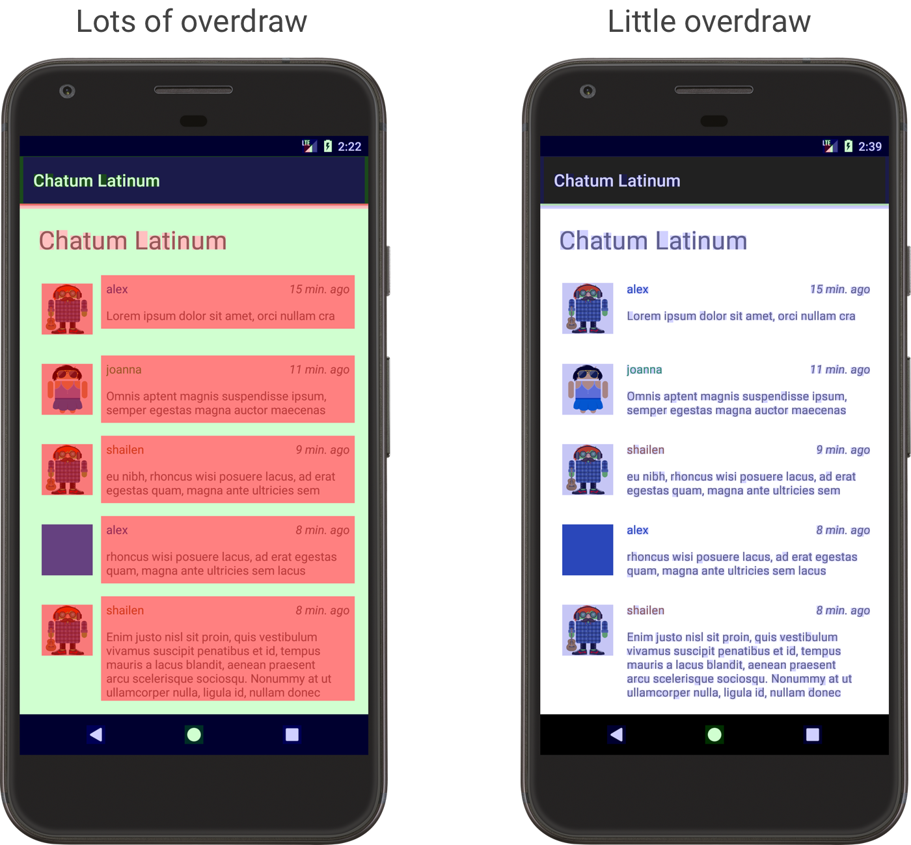

## 오버드로(Overdraw)란? 
단일 프레임에 동일한 픽셀을 두 번이상 그리는 작업을 의미한다. UI 카드는 [페인터의 알고리즘(뒤에서 앞으로)](https://ko.wikipedia.org/wiki/%ED%99%94%EA%B0%80_%EC%95%8C%EA%B3%A0%EB%A6%AC%EC%A6%98)으로 그려지기에 사용자에게 보여지지 않는 부분까지 그려진다. 오버드로가 발생하면 GPU 시간을 낭비하여 성능 문제로 나타난다. 

> [공식 문서](https://developer.android.com/topic/performance/rendering/overdraw?hl=ko#understanding)에 따르면 OS가 최적화되었기 때문에 오버드로는 2015년 google I/O에서 논의되었던 것처럼 크게 중요한 문제가 아니라고 한다. 

### 오버드로가 있는지 어떻게 확인할 수 있을까?
- [**GPU 오버드로 디버그 도구**](https://developer.android.com/topic/performance/rendering/overdraw?hl=ko#dgot) : 각 픽셀이 그려지는 횟수를 색상으로 구분하여 표시해주는데, 파랑>초록>분홍>빨강 순으로 오버드로가 많다는 뜻이다. 기기의 개발자 옵션에서 'GPU 오버드로 디버그' 도구를 사용할 수 있다. 

- [**프로파일 GPU 렌더링 도구**](https://developer.android.com/topic/performance/rendering/inspect-gpu-rendering?hl=ko#profile_rendering) : 프레임당 16ms의 벤치마크(연산성능 수치를 객관적으로 표시하는 것을 의미함)를 기준으로 UI창의 프레임을 렌더링하는 데 걸리는 시간을 히스토그램으로 표시해주는 도구이다. 기기의 개발자 옵션에서 '프로필 GPU 렌더링(프로필 HWUI 렌더링)' 도구를 사용할 수 있다. GPU가 픽셀을 그리느라 성능이 저하되거나 오버로드가 심한 경우를 파악할 수 있다. 자세한 분석 방법은 공식문서의 [GPU 렌더링 프로파일로 분석](https://developer.android.com/topic/performance/rendering/profile-gpu?hl=ko) 섹션에서 확인할 수 있다.

### 오버드로를 줄이는 방법
공식 문서에서는 아래의 방법을 사용하면 오버드로를 줄일 수 있다고 설명한다.
- **레이아웃에서 불필요한 배경 제거하기** : [Layout Inspector](https://developer.android.com/studio/debug/layout-inspector?hl=ko)를 사용하면 레이아웃의 계층 구조를 파악하여 사용자에게 보이지 않는 배경을 제거할 수 있다. 앱의 기본 배경색을 잘 활용하면 배경 위의 모든 컨테이너를 배경 값 없이 사용할 수 있다. 
- **뷰 계층 구조의 평면화** : 중첩되는 UI 개체의 수를 줄여 뷰 계층 구조를 최적화하면 성능을 향상시킬 수 있다. 
- **투명도 줄이기** : 알파 렌더링(화면에 투명 픽셀을 렌더링하는 것, 즉 투명도를 더하는 것)은 오버드로의 주요 원인이다. 시스템이 기존 픽셀을 그린 다음 올바른 혼합 등식을 얻을 수 있기 때문이다. 투명 애니메이션, 페이드 아웃, 그림자 등의 효과는 모두 어느 정도의 알파 블렌딩을 포함하고 있다. 알파 블렌딩이 성능에 부과하는 비용에 대해서는 [숨겨진 투명도 비용](https://youtu.be/wIy8g8yNhNk)에 설명되어 있다. 동일한 시각 효과를 준다면 알파 블렌딩 보다는 불투명한 색상으로 표현하는 것이 성능 비용을 줄일 수 있는 방법이다.

### 뷰 계층 구조 문제 진단하기
- [Systrace](https://developer.android.com/topic/performance/tracing/command-line?hl=ko) : 안드로이드 기기 전체에서 타이밍 정보를 수집/검사하여 레이아웃의 성능 관련 문제가 언제 성능 문제를 일으키는지 확인할 수 있다. 
- [프로파일 GPU 렌더링](https://developer.android.com/studio/profile/dev-options-rendering?hl=ko) : 레이아웃 및 측정 단계에서 [각 렌더링 프레임에 걸리는 시간](https://youtu.be/erGJw8WDV74)을 확인할 수 있다. 이렇게 측정한 데이터를 통해 런타임 성능 문제를 진단할 수 있으며, 해결해야 하는 레이아웃 및 측정 문제가 있는지의 여부, 그 문제의 내용 등을 알 수 있다.
- [Lint](https://developer.android.com/studio/write/lint?hl=ko) : 뷰 계층 구조에 있는 비효율성을 판단할 수 있다. 
- [Layout Inspector](https://developer.android.com/studio/debug/layout-inspector?hl=ko) : 앱의 뷰 계층 구조를 시각적으로 표현할 수 있다. Layout Inspector에서 제공하는 뷰를 통해 이중 과세로 발생하는 성능 문제도 식별할 수 있다. 또한 중첩된 레이아웃의 딥 체인이나 중첩된 하위 요소가 많은 레이아웃 영역(성능 비용의 또 다른 잠재적 원인)을 쉽게 식별할 수 있다. 참고 : [Layout Inspector로 레이아웃 디버깅을 하는 방법](https://developer.android.com/studio/debug/layout-inspector?hl=ko)

### 참고 자료
- [Google 공식문서 - 오버드로 줄이기](https://developer.android.com/topic/performance/rendering/overdraw?hl=ko)
- [Google 공식문서 - 성능 및 뷰 계층 구조](https://developer.android.com/topic/performance/rendering/optimizing-view-hierarchies?hl=ko)
- [Google 공식문서 - GPU 렌더링 프로파일로 분석](https://developer.android.com/topic/performance/rendering/profile-gpu?hl=ko)
