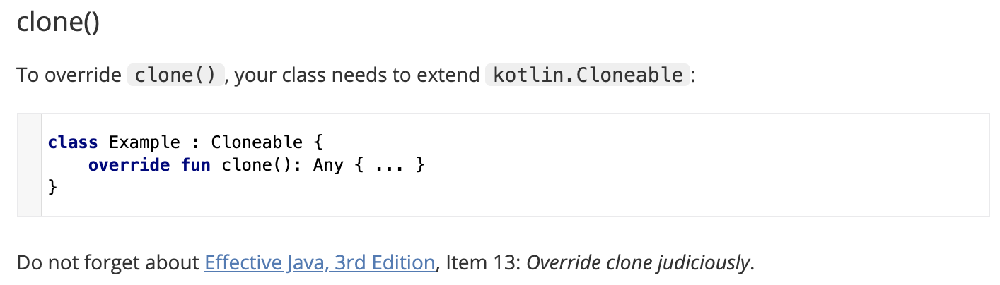

## Today I Learned
### 이펙티브 자바 아이템 13. clone 재정의는 주의해서 진행하라.
- clone 재정의에는 아래와 같은 문제점들이 있다. 
    - clone은 Object의 protected 메서드이며 Cloneable에는 아무런 메서드가 없다. 하지만 Cloneable은 clone 동작 방식을 결정한다. clone을 구현하고 싶다면 Cloneable 인터페이스를 상속하여 구현해야만 하며 그렇지 않으면 CloneNotSupportedException이 발생한다.
    - clone 메서드의 일반 규약은 허술하다. clone 메서드가 super.clone이 아닌 생성자를 호출해 얻은 인스턴스를 반환해도 컴파일러 오류는 나지 않는다. 하지만 이 클래스의 하위 클래스에서 super.clone을 호출한다면 잘못된 클래스의 객체가 만들어져 결국 하위 클래스의 clone 메서드가 제대로 동작하지 않게 된다. 
- 따라서 Cloneable을 구현하는 모든 클래스는 clone을 재정의해야 한다. 접근 제한자는 public으로, 반환 타입은 클래스 자신으로 변경하고 이 clone 메서드는 가장 먼저 super.clone을 호출한 후 필요한 필드를 전부 적절히 수정하도록 한다. 하지만 이는 너무 복잡하다.
- 더 나은 해결책으로 복사 생성자와 복사 팩터리를 이용하는 것을 권장한다. 복사 생성자와 복사 팩터리의 장점은 언어모순적이고 위험한 객체 생성 메커니즘(생성자를 쓰지 않는 방식)을 사용하지 않으며, 엉성하게 문서화된 규약에 기대지 않고, 정상적인 final 필드 용법과도 충돌하지 않으며, 불필요한 검사 예외를 던지지 않고, 형변환도 필요하지 않다. 또한, 복사 생성자와 복사 팩터리는 해당 클래스가 구현한 '인터페이스' 타입의 인스턴스를 인수로 받을 수 있다. 이러한 인터페이스 기반 복사 생성자와 복사 팩터리의 정확한 이름은 변환 생성자(conversion constructor)와 변환 팩터리(conversion factory)이다. 이를 이용하면 클라이언트는 원본의 구현 타입에 얽매이지 않고 복제본의 타입을 직접 선택할 수 있다.
- 그렇다면 코틀린에서는 clone이 어떻게 사용될까? 코틀린 공식 문서를 보니 아래와 같이 나와있다.



- 정리해보면, clone 재정의가 꼭 필요한 경우가 아니라면 아래와 같은 복사 생성자나 복사 팩터리 방식으로 객체를 복사하자. (예외적으로 배열의 clone은 안정적으로 원본 배열을 반환하므로 배열 복제시에는 배열의 clone 메서드를 사용하는 것을 권장한다.)

```java
// 코드 13-7 복사 생성자
public Yum(Yum yum) { ... };


// 코드 13-8 복사 팩터리
public static Yum newInstance(Yum yum) { ... };
```